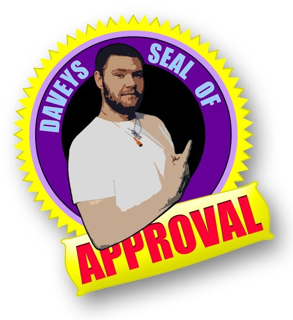

<!-- AUTO-GENERATED-CONTENT:START (STARTER) -->

  

<h1 align="center">
  David's janky AF website.
</h1>

Cheeky repo for me to learn and play with React and Gatsby.

# Useful commands

-1. Install `nodejs` and `npm` - Required
0. `npm install -g gatsby-cli` - Because for some reason, Gatsby needs installing first even though it's in package.json. Might need sudo.
0.5. Check `npm outdated` - Not running the site for a while will mean things are old. Meaning it won't run and you'll miss another episdode of House.
1. `npm install` - Get this sucka setup. Might need sudo.
2. `gatsby develop` - Run this sucka locally.
